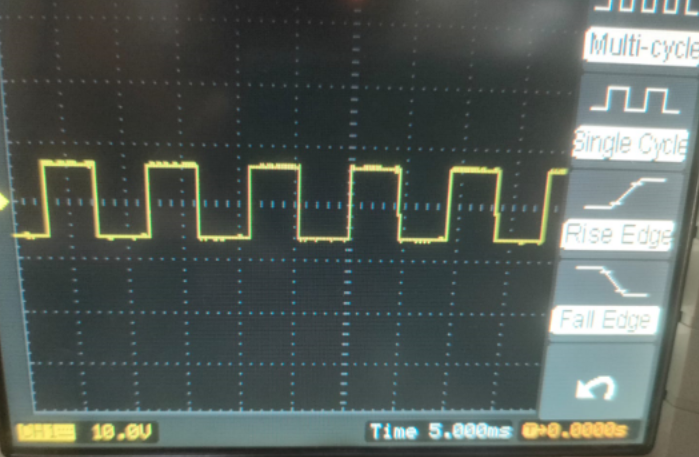

# Function-Generator
The repo contains the simulation and hardware implementation for the function generator that generates the sine, square and triangular waves 
### Block Diagram
 
### Dual Polarity Source
 
### Wave Generator
 
### Simulation Results
 
### Hardware Implementation

Square wave            |  Triangular wave
:-------------------------:|:-------------------------:
  |  
### Sine 

